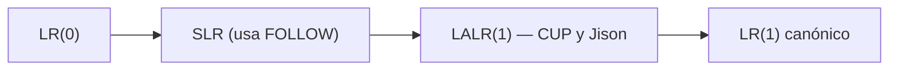

# Análisis sintáctico ascendente LR

Construye el árbol de las **hojas a la raíz** con una pila y dos acciones: **desplazar** (shift) y **reducir** (reduce, cuando la cima es el cuerpo de una producción = *mango*). Es lo que hacen [[CUP]] y [[Jison]].

Familia, de menor a mayor poder:

**LALR(1)** es el algoritmo por defecto de CUP y Jison: tablas compactas con casi el poder de LR(1).

## Relacionadas
- [[Conflictos shift-reduce y reduce-reduce]]
- [[Análisis sintáctico descendente LL(1)]]
- [[Ambigüedad, precedencia y asociatividad]]
