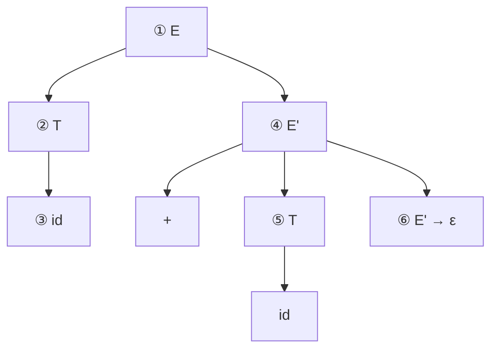

# Análisis sintáctico descendente LL(1)

Construye el árbol de la **raíz a las hojas**. **LL(1)** = leer de izquierda a derecha, derivación por la izquierda, 1 token de anticipación.

Una gramática es LL(1) si para toda `A → α | β`: [[FIRST y FOLLOW|FIRST]](α) y FIRST(β) son disjuntos, a lo sumo una deriva ε, etc. Con FIRST/FOLLOW se llena la **tabla predictiva** `M[A,a]`. El **descenso recursivo** es su implementación "a mano" (un método por no terminal).

Orden de construcción **top-down** para `id + id` con `E → T E'`, `E' → + T E' | ε`, `T → id` (los números ①–⑥ marcan en qué paso se expande cada nodo, siempre el no terminal **más a la izquierda**, mirando 1 token):

> No permite gramáticas recursivas por la izquierda ni ambiguas ([[Recursividad por la izquierda y factorización]]).

## Relacionadas
- [[FIRST y FOLLOW]]
- [[Análisis sintáctico ascendente LR]]
- [[Derivaciones y árbol de análisis sintáctico]]
