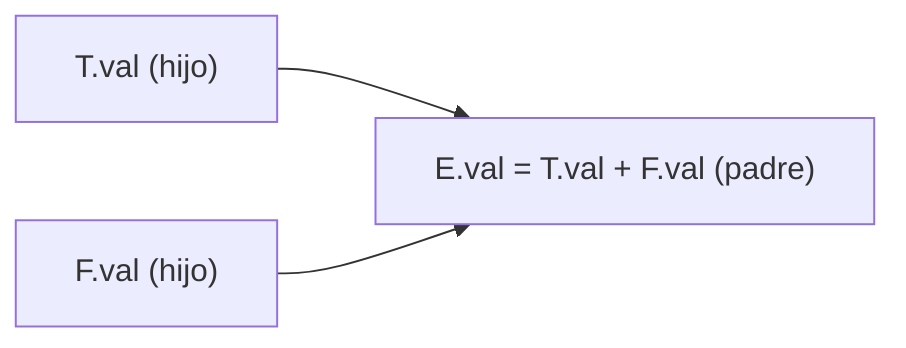

# Atributos sintetizados y heredados

- **Sintetizado:** se calcula desde los valores de los **hijos** (de abajo hacia arriba). Ej.: `E.val = E1.val + T.val`.
- **Heredado:** se define desde el **padre**, los **hermanos** o el propio nodo. Ej.: propagar el tipo a una lista de variables (`int a,b,c`).

Los terminales solo tienen atributos sintetizados (su valor lo da el léxico).

## El grafo de dependencias (§5.2) — la teoría de POR QUÉ existen S y L

Sobre un árbol anotado, el **grafo de dependencias** pone un nodo por cada instancia de atributo y una **flecha `a → b`** si para calcular `b` hace falta `a`. Ese grafo determina los **órdenes de evaluación válidos**: cualquier **orden topológico** del grafo (procesar un atributo solo después de aquellos de los que depende) sirve.

- Si el grafo **no tiene ciclos**, existe al menos un orden topológico → la SDD es evaluable.
- Un **ciclo** hace la SDD **inevaluable**: `A.s = B.i` y `B.i = A.s + 1` no se pueden resolver (fig. 5.2). Decidir si una SDD tiene circularidad en general es un problema **exponencial**, así que no se hace en la práctica.

**S-atribuida** y **L-atribuida** son las dos subclases que **garantizan un grafo acíclico** (y por eso son las útiles):

- **S-atribuida:** solo atributos **sintetizados**. Las flechas siempre suben → se evalúa en cualquier recorrido de abajo hacia arriba; encaja con parsing **LR** (se resuelve en la pila, ver [[Traducción dirigida por la sintaxis]]).
- **L-atribuida (§5.2.4):** cada atributo **heredado** de un símbolo del cuerpo `A → X₁…Xₙ` puede depender **solo** de atributos del **padre `A`**, de los **hermanos a su IZQUIERDA** (`X₁…Xᵢ₋₁`) y de sí mismo (la "L" es de *left*). Nunca de hermanos a la derecha. Así la información fluye de izquierda a derecha en una sola pasada → encaja con parsing **LL** (descendente) y con el recorrido natural. Toda S-atribuida es también L-atribuida.

## Relacionadas
- [[Traducción dirigida por la sintaxis]]
- [[Recorridos de árboles (preorden y postorden)]]
- [[Árbol de sintaxis abstracta (AST)]]
- [[Comprobación de tipos]]
