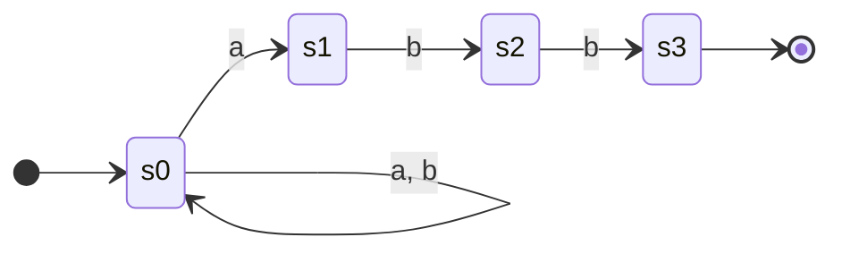

# Autómata finito (AFN y AFD)

Máquina de estados que reconoce un lenguaje regular.

- **AFN** (no determinista): permite transiciones‑ε y varias salidas por símbolo.
- **AFD** (determinista): una sola transición por símbolo, sin ε. Es lo que **ejecuta** el analizador léxico (un recorrido hacia adelante).

AFN para `(a|b)*abb` (fig. 3.24 del Dragón). El **no determinismo** se ve en `s0`: con `a` puede quedarse en `s0` o pasar a `s1`:

El AFD equivalente (una sola salida por símbolo en cada estado) está dibujado en [[Construcción de subconjuntos]].

Pipeline: [[Expresiones regulares]] → AFN ([[Construcción de Thompson]]) → AFD ([[Construcción de subconjuntos]]) → AFD mínimo ([[Minimización de AFD]]).

> [[JFlex]] y [[Jison]] hacen todo este pipeline por vos a partir de tus ER.

## Relacionadas
- [[Construcción de subconjuntos]]
- [[Minimización de AFD]]
- [[Expresiones regulares]]
