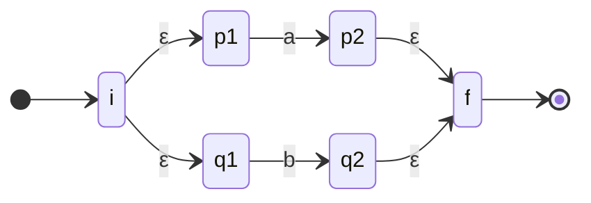
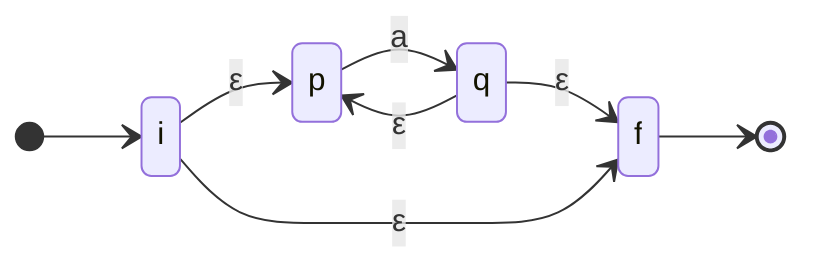

# Construcción de Thompson

Algoritmo (McNaughton-Yamada-Thompson) que convierte una [[Expresiones regulares|expresión regular]] en un **AFN**, componiendo fragmentos: un fragmento para ε, uno por símbolo, y reglas para `|` (unión), concatenación y `*` (cerradura). Cada fragmento tiene un estado inicial y uno de aceptación conectados por transiciones‑ε.

**Fragmento para la unión `a|b`** — un inicio y un fin nuevos, conectados por ε a los fragmentos de `a` y de `b`:

**Fragmento para la cerradura `a*`** — permite cero repeticiones (ε directo de `i` a `f`) o volver a empezar (ε de vuelta):

La **concatenación `ab`** simplemente fusiona el estado final del fragmento de `a` con el inicial del de `b` (sin ε extra).

Es el primer paso del pipeline que luego pasa a AFD con la [[Construcción de subconjuntos]].

## Relacionadas
- [[Autómata finito (AFN y AFD)]]
- [[Construcción de subconjuntos]]
- [[Expresiones regulares]]
