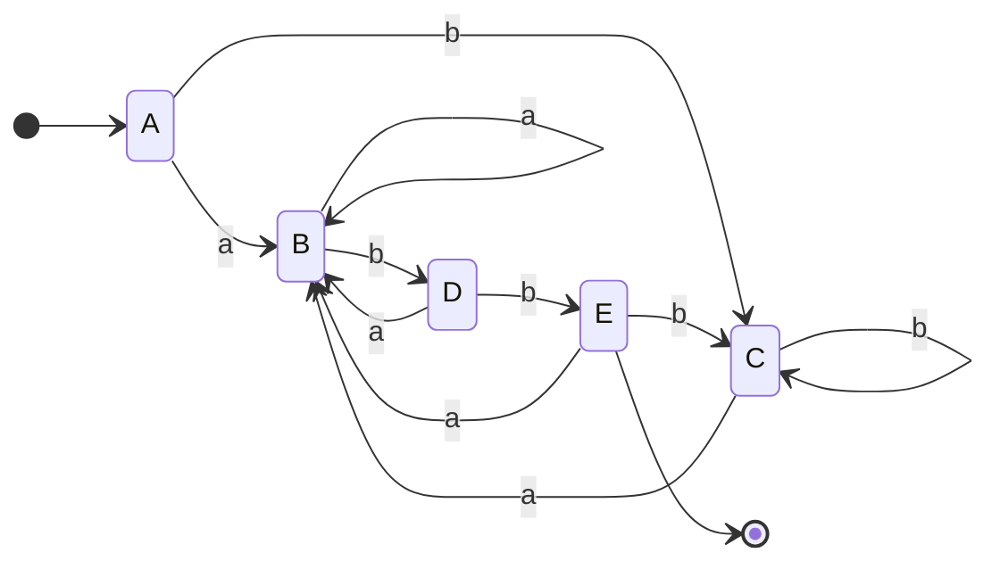

# Construcción de subconjuntos

Convierte un **AFN → AFD**. Cada estado del AFD es un **conjunto** de estados del AFN. Usa dos operaciones:
- **ε-cerradura(T):** estados alcanzables desde `T` solo con ε.
- **mover(T, a):** estados alcanzables desde `T` con el símbolo `a`.

Regla: `Dtran[A, a] = ε-cerradura(mover(A, a))`.

Ejemplo del libro para `(a|b)*abb`:

Luego se aplica [[Minimización de AFD]] para reducir estados.

## Relacionadas
- [[Construcción de Thompson]]
- [[Minimización de AFD]]
- [[Autómata finito (AFN y AFD)]]
