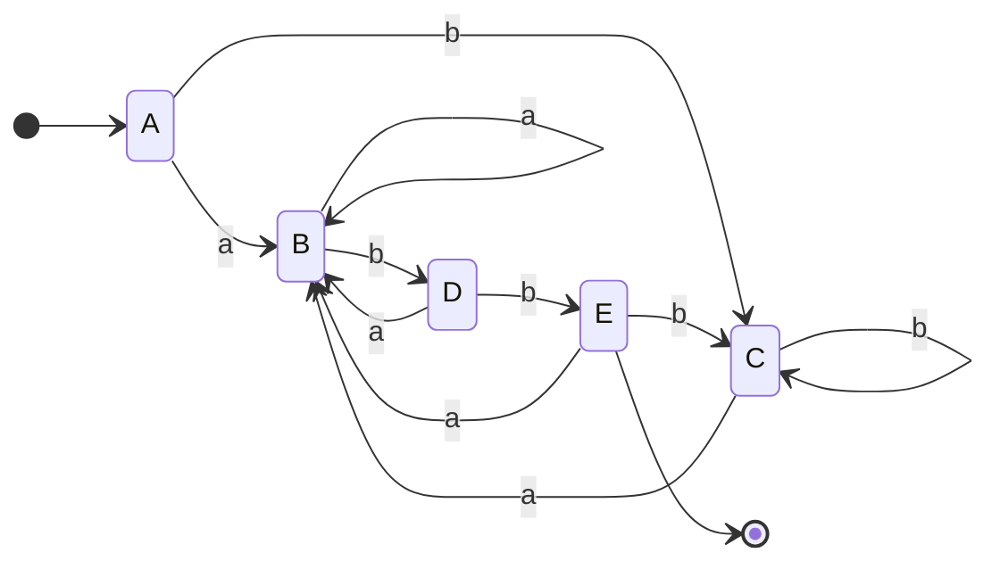

# Construcción de subconjuntos

Convierte un **AFN → AFD**. Cada estado del AFD es un **conjunto** de estados del AFN; el AFD simula "en paralelo" todos los movimientos posibles del AFN. Usa dos operaciones (fig. 3.31):
- **ε-cerradura(T):** estados alcanzables desde algún estado de `T` usando **solo** transiciones ε.
- **mover(T, a):** estados alcanzables desde algún estado de `T` con el símbolo `a`.

Regla de transición: `Dtran[A, a] = ε-cerradura(mover(A, a))`. El estado inicial del AFD es `ε-cerradura(s₀)`; un estado del AFD **acepta** si su conjunto contiene algún estado de aceptación del AFN.

## El algoritmo, ejecutable a mano (fig. 3.32)

```text
inicial: ε-cerradura(s₀) es el único estado en Destados, sin marcar
while ( hay un estado T sin marcar en Destados ) {
    marcar T;
    for ( cada símbolo de entrada a ) {
        U = ε-cerradura( mover(T, a) );
        if ( U no está en Destados ) agregar U sin marcar;
        Dtran[T, a] = U;
    }
}
```

`ε-cerradura(T)` se calcula con una búsqueda en el grafo (fig. 3.33): meter `T` en una pila y, mientras no esté vacía, sacar `t` y agregar todo `u` alcanzable por ε que aún no esté.

## Traza trabajada — ejemplo 3.21, AFN de `(a|b)*abb` (11 estados 0–10)

Estado inicial `A = ε-cerradura(0) = {0,1,2,4,7}`. De `A`, solo 2 y 7 tienen transición sobre `a` (a 3 y 8), así que `mover(A,a)={3,8}` y `Dtran[A,a]=ε-cerradura({3,8})={1,2,3,4,6,7,8}=B`. Solo 4 tiene `b` (a 5): `Dtran[A,b]=ε-cerradura({5})={1,2,4,6,7}=C`. Siguiendo con los conjuntos sin marcar se llega a la tabla completa:

| Estado AFD | Conjunto de estados AFN | sobre `a` | sobre `b` |
|---|---|---|---|
| A (inicial) | {0,1,2,4,7} | B | C |
| B | {1,2,3,4,6,7,8} | B | D |
| C | {1,2,4,5,6,7} | B | C |
| D | {1,2,4,5,6,7,9} | B | E |
| E (acepta, tiene el 10) | {1,2,3,5,6,7,10} | B | C |

Solo se materializan 5 subconjuntos (de los 2¹¹ posibles). El AFD queda con un estado más que el mínimo (A y C tienen la misma función de movimiento) → luego se aplica [[Minimización de AFD]]. El AFD resultante:



Este algoritmo es lo que fundamenta el paso de [[Del autómata al analizador léxico|reconocer a tokenizar]] y lo que un generador como [[JFlex]] hace internamente.

## Relacionadas
- [[Construcción de Thompson]]
- [[Minimización de AFD]]
- [[Autómata finito (AFN y AFD)]]
- [[Del autómata al analizador léxico]]
