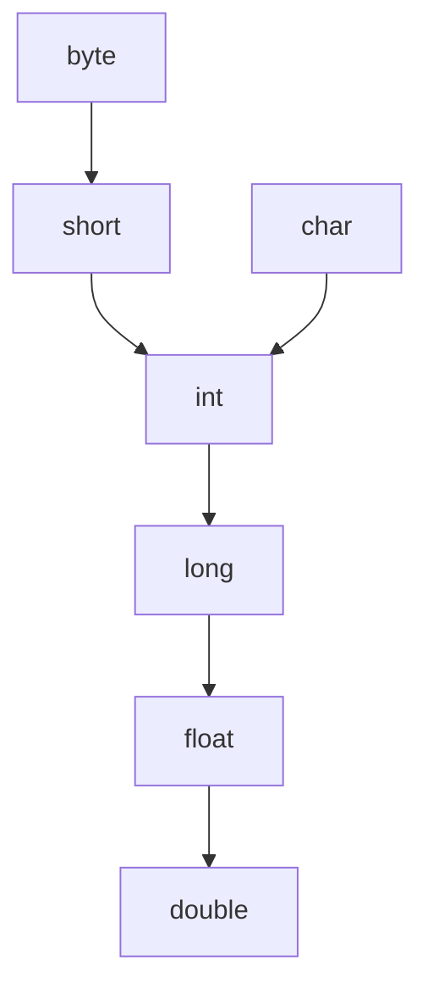

# Conversión de tipos (coerción y cast)

- **Ampliación (widening):** preserva información (`char → int → float`).
- **Reducción (narrowing):** puede perder información (sentido inverso).
- **Coerción (implícita):** el compilador la inserta solo, y suele limitarse a **ampliaciones** (ej. `(float)2` en `2 * 3.14`).
- **Cast (explícita):** el programador la escribe.

## La jerarquía de ampliación de Java (fig. 6.25a)



Un tipo de nivel menor puede **ampliarse** a uno mayor. Ojo: `char` amplía a `int`/`float` pero **no** a `short` (y `char`/`short`/`byte` se convierten entre sí solo por *reducción*, fig. 6.25b).

## La mecánica que ejecuta todo intérprete al evaluar `int + double` (§6.5.2)

La acción semántica de `E → E₁ + E₂` usa dos funciones:

1. **`max(t₁, t₂)`** — devuelve el tipo **mayor** de los dos en la jerarquía de ampliación (el tipo del resultado). Declara error si alguno no está en la jerarquía (p. ej. un arreglo).
2. **`ampliar(a, t, w)`** — promueve el operando `a` de tipo `t` al tipo `w`; si `t == w` lo deja igual, si no, genera la conversión:

```text
Dir ampliar(Dir a, Tipo t, Tipo w) {
    if (t == w) return a;                       // ya es del tipo destino
    else if (t == integer && w == float) { ... (float) a ... }
    else error;
}
```

Para `E → E₁ + E₂`: `E.tipo = max(E₁.tipo, E₂.tipo)`, y cada operando se pasa por `ampliar(..., E.tipo)` antes de sumar. Este `max` + `ampliar` es **el esqueleto exacto de la dominancia de tipos** del método `Operaciones` de los proyectos: cuando `int + double`, el resultado es `double` (el `max`) y el `int` se promueve (el `ampliar`).

> El `CAST(exp AS tipo)` de [[CompScript]]/[[CompInterpreter]] es la conversión **explícita**; las promociones int→double en operaciones son **coerciones** implícitas (solo de ampliación).

## Relacionadas
- [[Comprobación de tipos]]
- [[CompScript]]
- [[CompInterpreter]]
- [[Cap 6 - Generación de código intermedio]]
