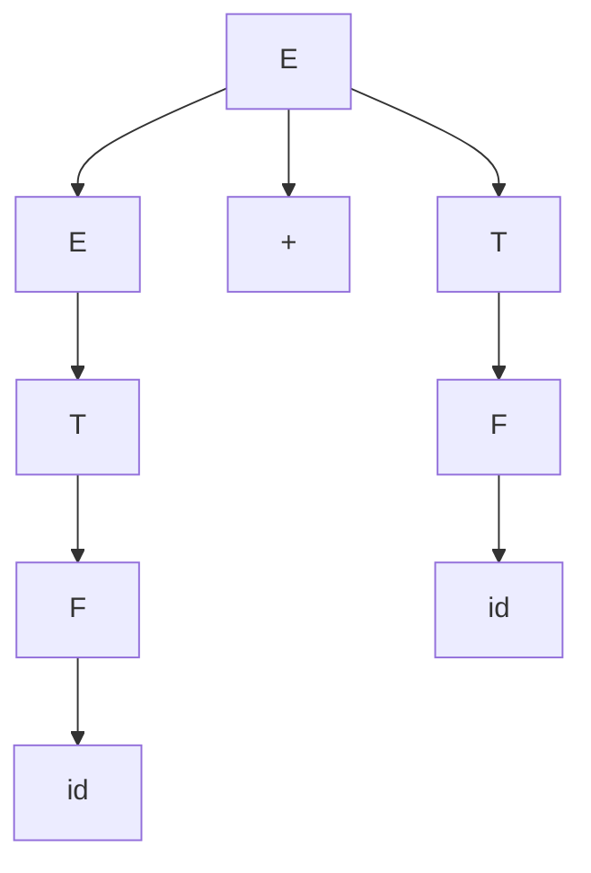

# Derivaciones y árbol de análisis sintáctico

- **Derivación:** aplicar producciones de una [[Gramática libre de contexto (BNF)|gramática]] para generar una cadena. Puede ser **por la izquierda** (se expande el no terminal más a la izquierda) o **por la derecha**.
- **Árbol de análisis sintáctico:** representación jerárquica de la derivación; hojas = terminales, nodos internos = no terminales.

**Ejemplo** — con `E → E + T | T`, `T → T * F | F`, `F → id`, derivación por la izquierda de `id + id`:

```
E ⇒ E + T ⇒ T + T ⇒ F + T ⇒ id + T ⇒ id + F ⇒ id + id
```

Su árbol de análisis (leyendo las hojas de izquierda a derecha se recupera la cadena):



> El [[Árbol de sintaxis abstracta (AST)|AST]] es este mismo árbol **sin el andamiaje**: quedaría solo `+` con dos hijos `id`.

El **análisis descendente** produce derivaciones por la izquierda; el **ascendente**, por la derecha en reversa.

## Relacionadas
- [[Gramática libre de contexto (BNF)]]
- [[Análisis sintáctico descendente LL(1)]]
- [[Análisis sintáctico ascendente LR]]
