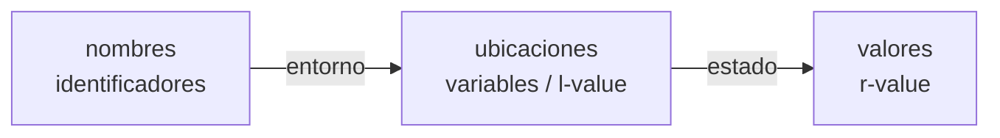

# Entornos y alcance

## Entorno vs estado — la asignación en dos etapas (§1.6.2, fig. 1.8, p. 26)

El libro separa dos asignaciones que cambian mientras el programa corre:

1. **Entorno** = asignación de **nombres → ubicaciones** de memoria. Como las variables *son* ubicaciones (los **l-values** en la terminología de C), un entorno es, en la práctica, la asignación de nombres a variables.
2. **Estado** = asignación de **ubicaciones → valores** (los **r-values**).

Una asignación como `x = y + 1` toca **las dos etapas**: el entorno dice *qué ubicación* denota `x` (su l-value), y el estado guarda ahí *el valor* (el r-value de `y + 1`). Esto es exactamente por qué la clase central de los 5 proyectos se llama **`Entorno`**: es la primera asignación (nombre → celda), y por eso guarda las variables como punteros/celdas mutables — asignar es cambiar el r-value de la celda que el entorno ya resolvió. Los entornos cambian según las **reglas de alcance** del lenguaje; el enlace nombre→ubicación es casi siempre dinámico (excepción: una global recibe su ubicación una sola vez al compilar, §1.6.2 p. 27).

## Alcance: estático vs dinámico

El **alcance (scope)** define dónde es visible un nombre.
- **Alcance estático (léxico):** depende de **dónde está escrito** (bloques anidados). Es el modelo de C, Java, JS y de todos los proyectos del curso.
- **Alcance dinámico:** depende de **quién llamó** en ejecución. Poco común, pero con 2 casos reales vigentes (§1.6.5, p. 32): las **macros de C** (los nombres se resuelven en el contexto de expansión) y el **despacho de métodos virtuales** (`x.m()` elige el método según el tipo del objeto en ejecución, ejemplo 1.8).

## La regla de alcance por bloques (§1.6.3, ejemplos 1.5–1.6, pp. 28–31)

Una declaración `D` del nombre `x` **pertenece** al bloque `B` si `B` es el bloque anidado más cercano que la contiene. La regla operativa:

> El alcance de `D` es **todo `B`**, excepto cualquier bloque `B'` anidado dentro de `B` donde `x` se **vuelva a declarar**.

Formulada desde el *uso* (la forma que implementa el intérprete): el uso de `x` se refiere a la declaración de `x` en el **bloque circundante más interno** que declare `x`. Eso es literalmente lo que hace `Entorno.buscar()` / `obtener()`: mira el entorno actual y **sube al entorno padre** (enlace de acceso) hasta encontrar el nombre. Cuando un bloque interno redeclara un nombre del externo, lo **oculta** (*shadowing*) — el `buscar` se detiene en el más cercano.

Se implementa con una [[Tabla de símbolos|tabla de símbolos]] como **pila/árbol de entornos**: un entorno por bloque/función, encadenados por el padre. Habilita globales vs locales, shadowing y llamadas anidadas (cada activación su propio entorno, ver [[Registro de activación y pila de control]]).

## Relacionadas
- [[Tabla de símbolos]]
- [[Paso de parámetros]]
- [[Registro de activación y pila de control]]
- [[CompScript]]
- [[Cap 1 - Introducción]]
