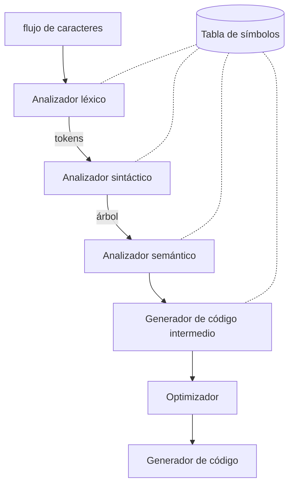

# Fases de un compilador

Un compilador se divide en **análisis (front-end)** y **síntesis (back-end)**. El análisis parte el fuente, le impone estructura gramatical, crea una representación intermedia y llena la [[Tabla de símbolos]]; la síntesis produce el código destino.

## Secuencia de fases

> La [[Tabla de símbolos]] no es una fase: es la **estructura compartida** que todas las fases consultan y actualizan (por eso las líneas punteadas).

- **Léxico** → produce [[Token, lexema y patrón|tokens]].
- **Sintáctico** → construye el árbol ([[Derivaciones y árbol de análisis sintáctico]]).
- **Semántico** → [[Comprobación de tipos]].
- **Intermedio / Optimización / Código** → back-end.

En los proyectos del curso solo se implementa el **front-end + intérprete** (ver [[Compilador vs intérprete]]).

## Relacionadas
- [[Compilador vs intérprete]]
- [[Tabla de símbolos]]
- [[Cap 1 - Introducción]]
