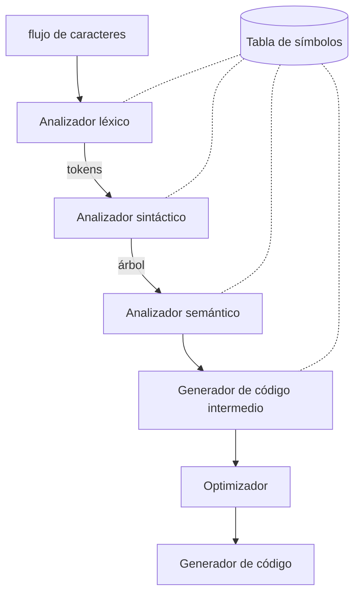

# Fases de un compilador

Un compilador se divide en **análisis (front-end)** y **síntesis (back-end)**. El análisis parte el fuente, le impone estructura gramatical, crea una representación intermedia y llena la [[Tabla de símbolos]]; la síntesis produce el código destino.

## Secuencia de fases

> La [[Tabla de símbolos]] no es una fase: es la **estructura compartida** que todas las fases consultan y actualizan (por eso las líneas punteadas).

- **Léxico** → produce [[Token, lexema y patrón|tokens]].
- **Sintáctico** → construye el árbol ([[Derivaciones y árbol de análisis sintáctico]]).
- **Semántico** → [[Comprobación de tipos]].
- **Intermedio / Optimización / Código** → back-end.

En los proyectos del curso solo se implementa el **front-end + intérprete** (ver [[Compilador vs intérprete]]).

## Fases vs pasadas (§1.2.8, p. 11)

No hay que confundir los dos términos —es una distinción clásica de examen—:

- Una **fase** es una **organización lógica** del trabajo del compilador (léxico, sintáctico, semántico…).
- Una **pasada** es una lectura de la entrada que **escribe una salida**, y puede **agrupar varias fases**. Por ejemplo, el análisis léxico, el sintáctico, el semántico y la generación de código intermedio suelen agruparse en **una sola pasada** (el front-end); la optimización puede ser una pasada aparte y opcional, y el back-end otra.

Los intérpretes del curso hacen esencialmente **una pasada** de front-end y ejecutan sobre el AST, sin generar código objeto.

## Relacionadas
- [[Compilador vs intérprete]]
- [[Tabla de símbolos]]
- [[Cap 1 - Introducción]]
