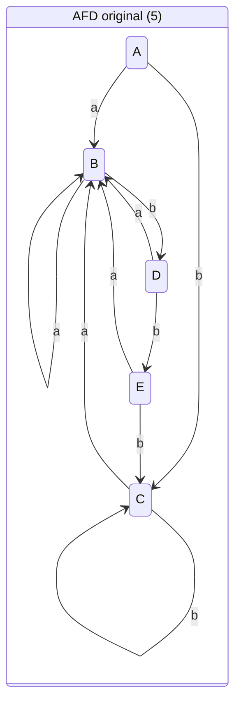
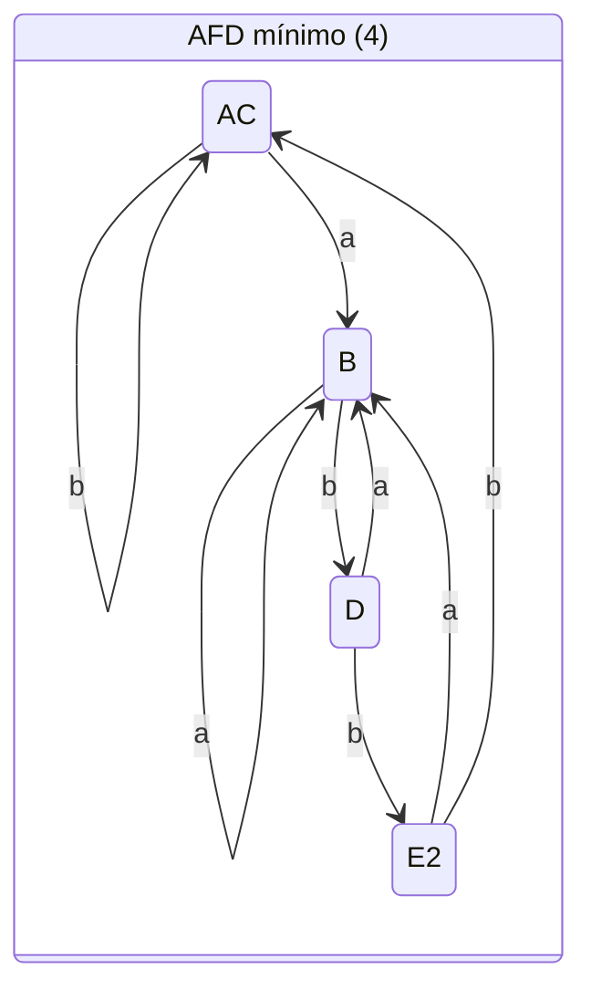

# Minimización de AFD

Reduce el número de estados de un AFD fusionando **estados equivalentes**, por **refinamiento de particiones**: se parte de dos grupos (aceptación / no aceptación) y se subdividen mientras dos estados del mismo grupo lleven a grupos distintos con algún símbolo.

**Ejemplo trabajado** — AFD de `(a|b)*abb` (el de [[Construcción de subconjuntos]], estados A–E, acepta E):

| Ronda | Partición | ¿Por qué se divide? |
|-------|-----------|---------------------|
| 0 | `{A,B,C,D}` `{E}` | Inicial: no-aceptación / aceptación |
| 1 | `{A,B,C}` `{D}` `{E}` | Con `b`, D va a E (grupo aceptación); A, B y C no |
| 2 | `{A,C}` `{B}` `{D}` `{E}` | Con `b`, B va a D (grupo propio); A y C van a C |

Ninguna división más es posible → **A ≡ C** se fusionan y el AFD queda en **4 estados**. Antes/después:

## Relacionadas
- [[Construcción de subconjuntos]]
- [[Autómata finito (AFN y AFD)]]
- [[Cap 3 - Análisis léxico]]
