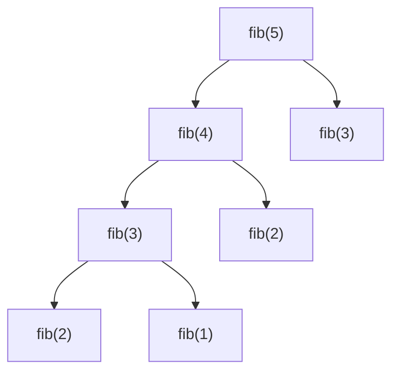

# Registro de activación y pila de control

Cada llamada a función crea un **registro de activación** (frame) con: parámetros, valor de retorno, **enlace de control**, **enlace de acceso**, estado de máquina, datos locales y temporales. La **pila de control** guarda las activaciones vivas.

> En un intérprete, el registro de activación ≈ **entorno** y la pila de control ≈ **pila de entornos**. La recursión funciona porque cada llamada tiene su propio entorno. Los campos de bajo nivel (estado de máquina, temporales) no aplican.

## El árbol de activación y por qué basta una PILA (§7.2.1)

El **árbol de activación** representa todas las llamadas de una ejecución (un nodo por activación). Tres propiedades lo conectan con la pila:
1. La secuencia de **llamadas** = recorrido en **preorden** del árbol.
2. La secuencia de **retornos** = recorrido en **postorden**.
3. Las **activaciones vivas** en un momento = el **camino de la raíz al nodo actual** — y eso es exactamente lo que hay en la pila.

En `fib(5)`, cuando se está evaluando la rama más profunda, en la pila conviven solo los registros del camino raíz→nodo (profundidad ~n), no todo el árbol — por eso la recursión cabe en una pila. (Ejercicio típico: dado quicksort/fibonacci, dibujar el árbol y decir cuántos frames conviven en el peor momento.)

## Enlace de acceso ≠ enlace de control — EL bug clásico de intérpretes (§7.3.5–7.3.6)

- **Enlace de control:** apunta al registro del **llamador** (orden **dinámico** de llamadas). Sirve para *volver* al terminar.
- **Enlace de acceso:** apunta al registro del procedimiento donde la función fue **declarada** (alcance **estático**). Si `p` está anidada en `q`, el enlace de acceso de `p` apunta a la activación más reciente de `q`. Sirve para *ver* variables no locales.

En un intérprete esta distinción **es** el bug: si al invocar una función creás su entorno como hijo del **entorno actual (el del llamador)** en vez del **entorno de declaración** (el global, o el de la función que la contiene), obtenés **alcance dinámico accidental** — una local del llamador se "filtra" a la función llamada. Por eso los proyectos crean el entorno de la función colgado del **global**, no del llamador: `NuevoEntorno(fn.Nombre, in.entGlobal)` en [[VLangCherry]], "el padre es siempre el global" en [[CompScript]], params en un hijo del global en [[CompInterpreter]]. Es la respuesta a *"¿por qué el entorno de una función cuelga del global y no de quien la llama?"* (ver [[Entornos y alcance]]).

## Cuando la pila se acaba: la misma teoría, dos runtimes opuestos

La pila es **finita**, así que una recursión sin caso base la agota. Lo interesante —y medido en los proyectos de este curso— es que **la consecuencia depende del lenguaje anfitrión del intérprete**, no de la teoría:

| Anfitrión | Qué pasa al agotar la pila | ¿Se puede atrapar? | Consecuencia para el intérprete |
|---|---|---|---|
| **Java** ([[CompScript]]) | Lanza `StackOverflowError` | **Sí**: es un `Throwable`, se captura | Se reporta "recursión demasiado profunda" con línea y columna, y el intérprete sigue vivo |
| **Go** ([[VLangCherry]]) | `fatal error: stack overflow` | **No**: `recover()` no intercepta errores fatales | **Muere el proceso entero** — y como es un servidor REST, se cae para todos, no solo para esa petición |

De ahí una conclusión de ingeniería que la teoría sola no da: en Go la protección tiene que ser **preventiva**, no reactiva. [[VLangCherry]] lleva un contador de **profundidad de llamadas** (tope 2 000) en su `invocarFuncion` y un contador de **iteraciones por ciclo** (tope 1 000 000) en su `for`, que reportan un [[Políticas de error semántico|error semántico]] *antes* de que el problema llegue a ser fatal. `recover()` sigue estando, pero para panics normales; no alcanza para este caso.

Es una buena respuesta a *"¿qué pasa si alguien manda una recursión infinita a tu servidor?"* — y la comparación Java/Go muestra que se entendió el porqué, no solo el qué.

## Funciones como parámetro = closures (§7.3.7)

Cuando se pasa una función como argumento, se pasa el par **⟨función, enlace de acceso⟩** (fig. 7.13) — para que, al invocarla, siga viendo el entorno donde fue **declarada** y no donde se llama. Ese par es lo que los lenguajes modernos llaman **closure**. Es la teoría detrás de callbacks/funciones-valor (relevante para CompInterpreter en JS) y la respuesta a "¿qué pasaría si tu lenguaje devolviera funciones?".

## Relacionadas
- [[Entornos y alcance]]
- [[Paso de parámetros]]
- [[Recolección de basura]]
- [[Tabla de símbolos]]
- [[Recorridos de árboles (preorden y postorden)]]
- [[Políticas de error semántico]]
- [[Cap 7 - Entornos en tiempo de ejecución]]
