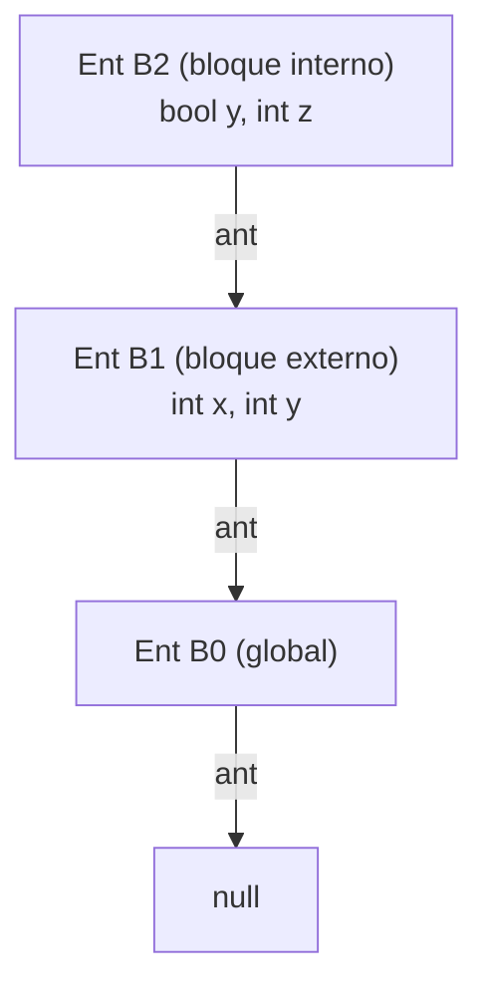

# Tabla de símbolos

Estructura de datos que guarda información de cada **nombre** del programa (tipo, valor, alcance, línea/columna). La usan **todas** las [[Fases de un compilador|fases del compilador]].

## El patrón canónico: tablas encadenadas (§2.7, fig. 2.37, p. 89)

El libro implementa la tabla como una clase **`Ent`** (abreviatura de *entorno*) con su **propia hash table** y un puntero **`ant`** al entorno padre — es, literalmente, la clase `Entorno` que implementan los 5 proyectos:

```java
public class Ent {
    private Hashtable tabla;
    protected Ent ant;                       // enlace al bloque circundante
    public Ent(Ent p) { tabla = new Hashtable(); ant = p; }
    public void put(String s, Simbolo sim) { tabla.put(s, sim); }
    public Simbolo get(String s) {
        for (Ent e = this; e != null; e = e.ant) {   // sube la cadena
            Simbolo enc = (Simbolo) e.tabla.get(s);
            if (enc != null) return enc;
        }
        return null;                          // no declarado en ningún ámbito
    }
}
```

`get` implementa la **regla del bloque anidado más cercano** (§2.7.1): un identificador `x` se resuelve en la declaración de `x` más interna, examinando los bloques de adentro hacia afuera. Entrar a un bloque = `guardado = sup; sup = new Ent(sup)`; salir = `sup = guardado` (fig. 2.38): las tablas se apilan y desapilan como una pila (conecta con [[Entornos y alcance]]).



**Ejemplo 2.15 / shadowing:** en `{ int x; int y; { bool y; ... y ...; } ... y ...; }`, la `y` del bloque interno es la `bool` (se redeclaró), pero la `y` de afuera vuelve a ser la `int` — la `Ent` interna se vuelve inaccesible al salir.

> **Pregunta de examen — ¿quién crea las entradas?** El **analizador sintáctico**, no el lexer: son **acciones semánticas** las que hacen `put` al reducir una declaración y `get` al reducir un uso (§2.7.2). El lexer solo produce el token `id`.

En un intérprete, la tabla se organiza así como una **pila/árbol de [[Entornos y alcance|entornos]]**; el **reporte de tabla de símbolos** de los proyectos (id, tipo, entorno, valor, línea, columna) es esta estructura volcada tras la ejecución.

## Relacionadas
- [[Entornos y alcance]]
- [[Paso de parámetros]]
- [[Registro de activación y pila de control]]
- [[Fases de un compilador]]
