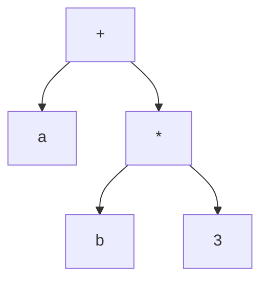

# Árbol de sintaxis abstracta (AST)

Representación intermedia en forma de árbol que captura la **estructura jerárquica** del programa, sin los detalles de la sintaxis concreta. Se construye con dos funciones: `Nodo(op, hijo1, hijo2)` y `Hoja(tipo, valor)`.

AST de `a + b * 3` — fijate que la precedencia queda **codificada en la forma del árbol** (el `*` más profundo se evalúa primero) y no quedan paréntesis ni no terminales intermedios:

A diferencia del [[Derivaciones y árbol de análisis sintáctico|árbol de análisis sintáctico]], el AST omite los no terminales de andamiaje (`E`, `T`, `F`): cada nodo **es** una operación y cada hoja un operando.

En un [[Compilador vs intérprete|intérprete]], el AST se **recorre** para ejecutar el programa. El **reporte AST** de los proyectos se dibuja con [[Graphviz]] (CompScript) o [[vis-network]] (CompInterpreter), y en el vault con [[Mermaid]].

## Tener o no tener AST decide la *superficie de error*

Que [[DataForge]] no construya AST —ejecuta directo en las acciones de [[CUP]]— suena a limitación. Vale la pena darlo vuelta: una decisión arquitectónica no solo define lo que el lenguaje **puede hacer**, define **qué familias de bugs son siquiera posibles**. La revisión de los cinco proyectos lo mostró con datos:

| Lo que DataForge no tiene | El bug que eso vuelve imposible | Dónde sí apareció |
|---|---|---|
| Operadores lógicos `&&` y `or` | Cortocircuito mal implementado: `x != 0 && 10/x > 1` revienta (ver [[Flujo de control y switch]]) | 3 de los otros proyectos |
| Indexación de arreglos | Índice sin validar tipo: un `NaN` pasa los chequeos de rango | [[CompInterpreter]] |
| Ciclos y llamadas | Recursión o `while` infinitos sin guarda | [[VLangCherry]] |
| Ámbitos anidados | Alcance dinámico accidental (ver [[Registro de activación y pila de control]]) | [[CompScript]] |

El argumento completo, para la defensa:

> «DataForge ejecuta en las acciones de CUP porque su lenguaje no tiene control de flujo — toda instrucción corre exactamente una vez. Esa misma ausencia elimina de raíz cuatro familias de bugs que sí tuve que cazar en los proyectos con AST.»

La contracara es igual de importante: **en el momento en que el lenguaje gana un `if`, el AST deja de ser opcional**, porque una instrucción puede correr cero, una o muchas veces y hace falta poder recorrerla a demanda.

## Nodos inmutables: lo que hace barato compartir subárboles

Si el AST se va a **reescribir** (optimizar, simplificar), la pregunta es si se pueden reutilizar subárboles del original o hay que clonarlos. [[ConjAnalyzer]] resolvió esto por diseño: los cuatro campos de su `NodoOperacion` son `final`, así que el nodo **no se puede mutar después de creado**.

Gracias a eso, cuando el simplificador aplica la distributiva `(A∩B)∪(A∩C) → A∩(B∪C)` puede meter **el mismo objeto** `A` en el árbol resultado en vez de copiarlo: nadie va a mutarlo a espaldas de nadie. La reescritura crea nodos nuevos donde algo cambia y **comparte referencias donde no**. Es el mismo motivo por el que `String` es inmutable en Java. Sin esa garantía harían falta copias defensivas en cada regla.

Es la respuesta a *«¿no se corrompe el árbol original al simplificar?»*: una línea de código, no una explicación.

## Relacionadas
- [[Traducción dirigida por la sintaxis]]
- [[Compilador vs intérprete]]
- [[Recorridos de árboles (preorden y postorden)]]
- [[Políticas de error semántico]]
- [[CompScript]]
- [[ConjAnalyzer]]
