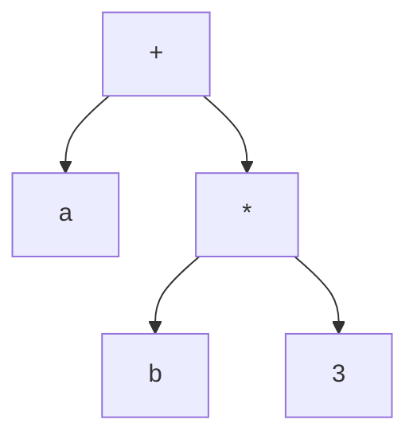

# Árbol de sintaxis abstracta (AST)

Representación intermedia en forma de árbol que captura la **estructura jerárquica** del programa, sin los detalles de la sintaxis concreta. Se construye con dos funciones: `Nodo(op, hijo1, hijo2)` y `Hoja(tipo, valor)`.

AST de `a + b * 3` — fijate que la precedencia queda **codificada en la forma del árbol** (el `*` más profundo se evalúa primero) y no quedan paréntesis ni no terminales intermedios:

A diferencia del [[Derivaciones y árbol de análisis sintáctico|árbol de análisis sintáctico]], el AST omite los no terminales de andamiaje (`E`, `T`, `F`): cada nodo **es** una operación y cada hoja un operando.

En un [[Compilador vs intérprete|intérprete]], el AST se **recorre** para ejecutar el programa. El **reporte AST** de los proyectos se dibuja con [[Graphviz]] (CompScript) o [[vis-network]] (CompInterpreter), y en el vault con [[Mermaid]].

## Relacionadas
- [[Traducción dirigida por la sintaxis]]
- [[Compilador vs intérprete]]
- [[CompScript]]
