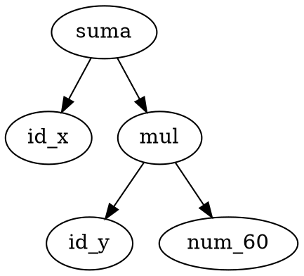

# Graphviz

Herramienta y lenguaje **DOT** para dibujar grafos. Se genera un archivo `.dot` desde el [[Árbol de sintaxis abstracta (AST)|AST]] y Graphviz produce la imagen del árbol.

Ejemplo DOT:

Es la opción recomendada por el enunciado de [[CompScript]] para el **reporte AST** en la app de escritorio. En web se prefiere [[vis-network]]; en el vault, [[Mermaid]].

## Usado en
[[CompScript]]

## Relacionadas
- [[Mermaid]]
- [[vis-network]]
- [[Árbol de sintaxis abstracta (AST)]]
