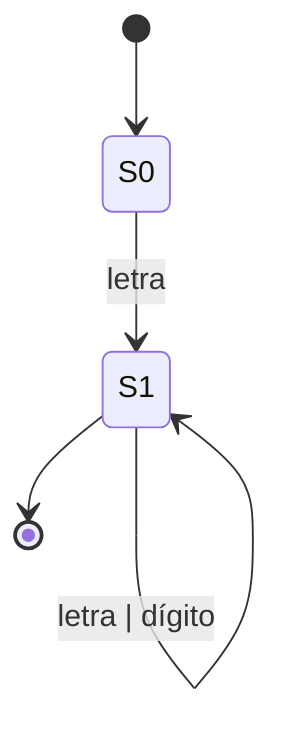

# Mermaid

Lenguaje para crear **diagramas desde texto**. **Obsidian lo renderiza nativo**, por lo que es la herramienta elegida para dibujar [[Autómata finito (AFN y AFD)|AFDs]], diagramas de estados y [[Árbol de sintaxis abstracta (AST)|ASTs]] **directo dentro de las notas** de este vault.

Ejemplo (AFD):

Para diagramas de estados muy complejos, **PlantUML** es el respaldo.

## Usado en
El propio vault (todas las notas con diagramas)

## Relacionadas
- [[Graphviz]]
- [[vis-network]]
- [[Árbol de sintaxis abstracta (AST)]]
